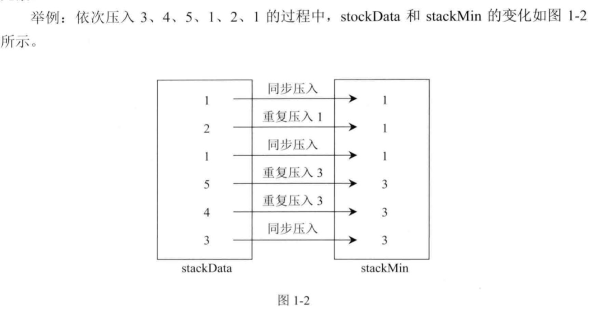
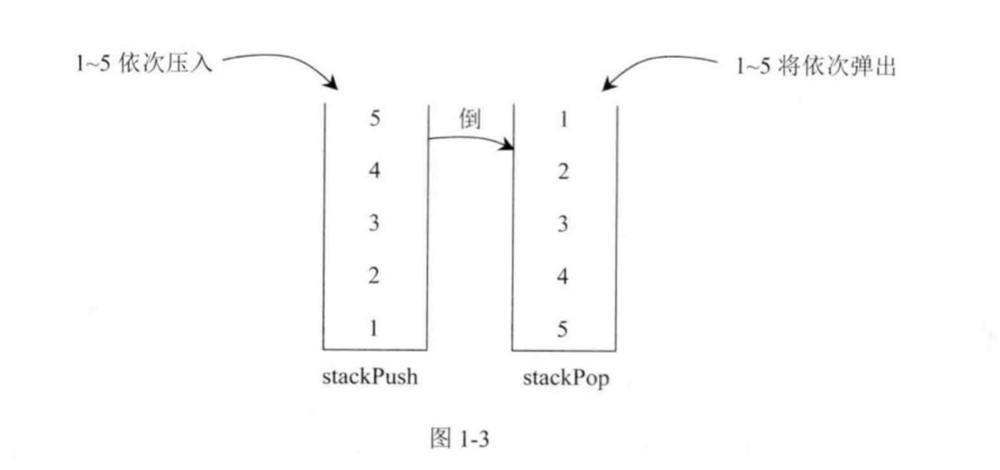
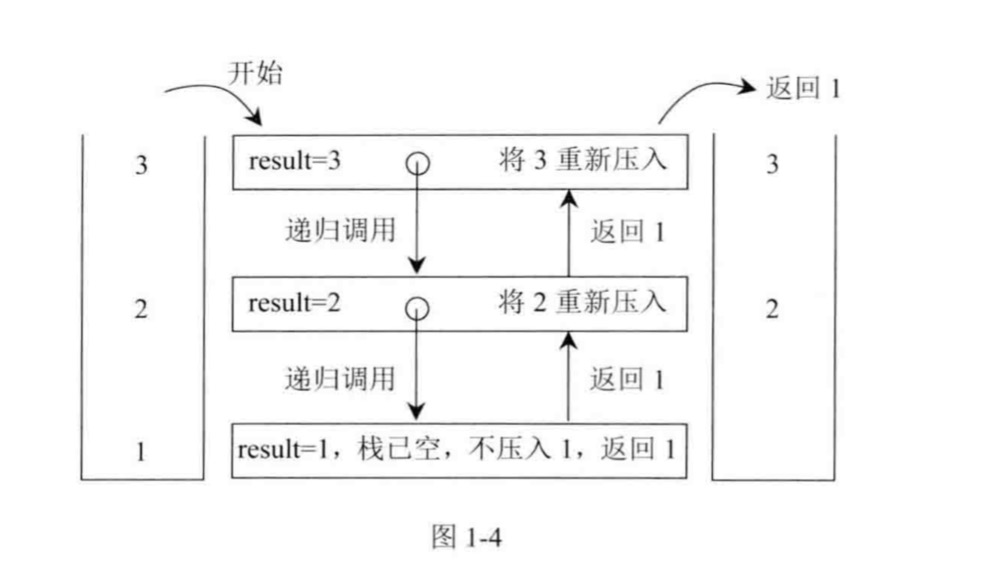

# 1. 栈和队列

## 1.1 设计一个有getMin功能的栈

### 题目

​	实现一个特殊的栈，在实现栈的基本功能的基础上，再实现返回栈中最小元素的操作。

### 要求

​	1. pop、push、getMin操作的时间复杂度都是$$O(1)$$

​	2. 设计的栈类型可以使用现成的栈结构

### 难度

​	士 一颗星

### 解答

​	设计思路为使用两个stack，一个用来存储正常stack数据，一个用来存储每次的最小值。有两种具体实现方式：

第一种设计方案：

-  压入数据规则

  假如当前数据为value，先将其压入stackData。然后判断stackMin是否为空

  - 如果stackMin为空，则直接将value压入stackMin
  - 如果value小于等于getMin的值，则将value压入stackMin
  - 如果value大于getMin的值，则stackMin中不压入任何数据
  - 

- 弹出数据规则

  ​	先在stackData中弹出栈顶元素，记为value，然后比较getMin的元素与value哪个更小。

  ​	通过上文提到的压入规则可知，stackMin中存在的元素是从栈底到栈顶逐渐变小的，stackMin栈顶的元素既是stackMin栈的最小值，也是当前stackData栈的最小值。所以不会出现value比stackMin的栈顶元素更小的情况，value只可能大于或等于stackMin的栈顶元素。

  - 仅当value等于stackMin的栈顶元素时，stackMin弹出栈顶元素

- 获取最小值

  由上文的压入和弹出数据规则可知，stackMIn始终记录着stackData的最小值，所以，stackMin的栈顶元素始终是当前stackData中的最小值

> tips：
>
> ​	所有pop或peek操作需提前校验是否为空

- 代码位置：com.tangwan.zuochengyun.chapter01_StackAndQueue.T01_GetMinFromStack.MyStack1


第二种设计方案：

- 压入数据规则

  假如当前数据为value，先将其压入stackData。然后判断stackMin是否为空

  - 如果stackMin为空，则直接将value压入stackMin
  - 如果value小于getMin的值，则将value压入stackMin
  - 如果value大于等于getMin的值，则stackMin中压入getMin

  - 

- 弹出数据规则

  stackData弹出，stackMin也弹出，因为stackData和stackMin是一对一的。

- 获取最小值：同上述方案

- 代码位置：com.tangwan.zuochengyun.chapter01_StackAndQueue.T01_GetMinFromStack.MyStack2

### 点评

方案一和方案二都是用stackMin栈保存着stackData每一步的最小值。

共同点：

- 所有操作的时间复杂度都是 $$O(1)$$、空间复杂度都为$$O(n)$$

区别：

- 方案一中stackMin压入时稍省时间，但是弹出操作稍费时间
- 方案二中stackMin压入时稍费时间，但是弹出操作稍省时间

### 完整代码位置

​	com.tangwan.zuochengyun.chapter01_StackAndQueue.T01_GetMinFromStack


## 1.2 由两个栈组成的队列

### 题目：

​	编写一个类，用两个栈实现队列，支持队列的基本操作（add、poll、peek）

### 难度：

​	尉 两颗星

### 解答：

​	栈的特点是FILO，而队列的特点是FIFO。使用两个栈正好能把顺序反过来实现类似队列的操作.

​	具体实现是：

-  一个栈作为压入，在压入数据的时候只往这个栈中压入，记为stackPush
- 另一个栈作为弹出栈，在弹出数据的时候只从这个栈弹出，记为stackPop


​	因为数据压入栈的时候，顺序是FILO的，那么只要把stackPush中的数据再压入stackPop中，顺序就变成FIFO了。

​	例如，将1~5依次压入stackPush，那么从stackPush的栈顶到栈底为5~1，此时依次再讲5~1倒入stackPop，那么从stackPop的栈顶到栈底就变成了1~5.再从stackPop弹出时，顺序就像队列一样，如下图所示。




> tips：
>
> 上述过程需注意两点：
>
> 1. 如果stackPush要往stackPop中压入数据，那么必须一次性把stackPush中的数据全部压入
> 2. 如果stackPop不为空，stackPush绝对不能向stackPop中压入数据
>
> 违反了以上两点都会发生错误。


### 代码

​	com.tangwan.zuochengyun.chapter01_StackAndQueue.T02_QueueConsistingOfTwoStacks


## 1.3 如何仅用递归函数和栈操作逆序一个栈

### 题目

​	一个栈依次压入1、2、3、4、5，那么从栈顶到栈底分别是5、4、3、2、1。将这个栈转置后，从栈顶到栈底为1、2、3、4、5，也就是实现栈中元素的逆序，但是只能用递归函数来实现，不能使用其他数据结构

###难度

​	尉 两颗星

### 解答

​	本题考查的操作和递归函数的设计，我们需要设计出两个递归函数。


递归函数一：将栈stack的栈底元素返回并移除
具体过程如代码`getAndRemoveLastElement`方法

```java
    private static int getAndRemoveLastElement(Stack<Integer> stack) {
        Integer result = stack.pop();
        if (stack.isEmpty()) {
            return result;
        } else {
            int last = getAndRemoveLastElement(stack);
            stack.push(result);
            return last;
        }
    }
```

如果从栈stack的栈顶到栈底依次为3、2、1，这个函数的具体过程如图1-4所示。




递归函数二：逆序一个栈

```
    public static void reverse(Stack<Integer> stack) {
        if (stack.isEmpty()) {
            return;
        }

        int i = getAndRemoveLastElement(stack);
        reverse(stack);
        stack.push(i);
    }
```

如果从stack的栈顶到栈底依次为3、2、1，reverse函数的具体过程如图所示：


> tips：
> ​	getAndRemoveLastElement方法在上图中简单表示为get方法，表示移除并返回当前栈底元素


## 1.4 猫狗队列

### 题目

​	宠物、狗和猫的类如下：

```java
    public class Pet {
        private String type;

        public Pet(String type) {
            this.type = type;
        }

        public String getType() {
            return type;
        }

    }

    public class Dog extends Pet {
        public Dog() {
            super("dog");
        }
    }

    public class Cat extends Pet {

        public Cat() {
            super("cat");
        }
    }
```

实现一种狗猫队列的结构，要求如下：

- 用户可以调用add方法将cat类或dog类的实例放入队列中；
- 用户可以调用pollAll方法，将队列中所有的实例按照进队列的先后顺序依次弹出；
- 用户可以调用pollDog方法，将队列中dog类的实例按照进队列的先后顺序依次弹出；
- 用户可以调用pollCat方法，将队列中cat类的实例按照进队列的先后顺序依次弹出；
- 用户可以调用isEmpty方法，检查队列中是否还有dog或cat的实例；
- 用户可以调用isDogEmpty方法，检查队列中是否有dog类的实例；
- 用户可以调用isCatEmpty方法，检查队列中是否有cat类的实例。

###难度

士 一颗星

### 解答

​	本题考查实现特殊结构的能力以及针对特殊功能的算法设计能力。

​	本题为开放类型的面试题，希望读者能有自己的实现，在这里列出几种常见的设计错误：

- cat队列只放cat实例，dog队列只放dog实例，再用一个总队列放所有的实例。

  > 错误原因：cat、dog以及总队列的更新问题

- 用哈希表，key表示一个cat实例或dog实例，value表示这个实例进队列的次序。

  > 错误原因：不能支持一个实例多次进队列的功能需求，因为哈希表的key只能对应一个value值

- 将用户原有的cat或dog类改写，加一个计数项来表示一个实例进队列的时间。

  > 错误原因：不能擅自改变用户的类结构


​	本题实现将不同的实例盖上时间戳的方法，但是又不能改变用户本身的类，所以定义一个新的类，具体实现如下：

```java
    public static class PetEnterQueue {
        private Pet pet;
        private long count;

        public PetEnterQueue(Pet pet, long count) {
            this.pet = pet;
            this.count = count;
        }
    }
```


PetEnterQueue类在构造时，pet是用户原有的实例，count就是这个实例的时间戳。


​	我们实现的队列其实是PetEnterQueue类的实例。大体来说，首先有一个不断累加的数据项，用来表示实例进队列的时间；同时有两个队列，一个是只放dog类实例的队列dogQ，另一个是只放cat类实例的队列catQ。

- 加入实例时
  - 如果实例时dog，就盖上时间戳，生成对应的PetEnterQueue类的实例，然后放入dogQ
  - 如果实例时cat，就盖上时间戳，生成对应的PetEnterQueue类的实例，然后放入catQ
- 弹出dog实例
  - 从dogQ里弹出
- 弹出cat实例
  - 从catQ里弹出
- 弹出任意实例
  - 因为dogQ的队列头表示所有dog实例中最早进队列的，同时catQ一样，所以比较两个队列头的时间戳，谁早弹谁


### 代码位置

​	com.tangwan.zuochengyun.chapter01_StackAndQueue.T04_PetQueue


## 1.5 用一个栈实现另一个栈的排序

### 题目

​	一个栈中元素的类型为整型，现在想将该栈从顶到底按从大到小的顺序排序。

### 要求

​	只需申请一个栈。除此之外，可申请新的变量，但不能申请额外的数据结构。

###难度

士 一颗星

### 解答

​	将要排序的栈记为stack，申请的辅助栈记为help。在stack上执行pop操作，弹出的元素记为cur。

- 如果cur小于或等于help的栈顶元素，则将cur直接压入help；
- 如果cur大于help的栈顶元素，则将help的元素逐一弹出，逐一压入stack，直到cuur小于或等于help的栈顶元素，再将cur直接压入help；

​	一直执行以上操作，直到stack中的全部元素都压入到help。最后将help中的所有元素逐一压入stack，即完成排序

### 代码

com.tangwan.zuochengyun.chapter01_StackAndQueue.T05_SortStackByStack


## 1.6 用栈来求解汉诺塔问题

### 题目

### 要求

###难度

### 解答

